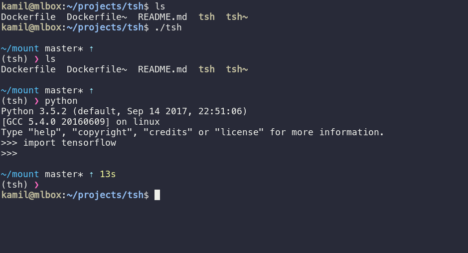

# tsh - deep learning shell

tsh is a wrapper around Docker image which provides recent deep learning tools. It mounts current directory and X11 socket inside a container. zsh shell with modern prompt ([pure](https://github.com/sindresorhus/pure)) is provided for git support.



## List of software

- Ubuntu 16.04
- CUDA 8.0
- cuDNN 6
- tensorflow 1.3
- keras 2.1.1
- pytorch 0.2
- OpenCV 3.3.1 (GTK support)
- ffmpeg
- numpy, scipy, pandas, sklearn, jupyter, matplotlib, Pillow, h5py, scikit-image, sk-video

shell:
- zsh with oh-my-zsh
- pure prompt
- running as standard user

## Requirements

Requires Nvidia GPU with drivers installed, as well as Docker and
nvidia-docker2.

## Installation

Make ```tsh``` executable by ```chmod +x tsh``` and make sure that ```tsh``` is copied / linked somewhere in the PATH (e.g. ```/usr/bin```)
